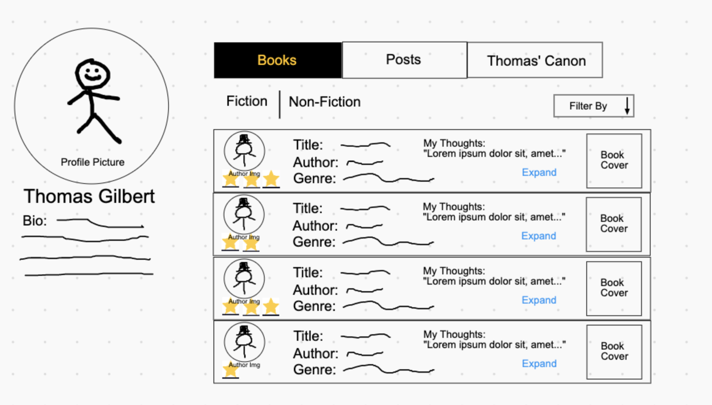
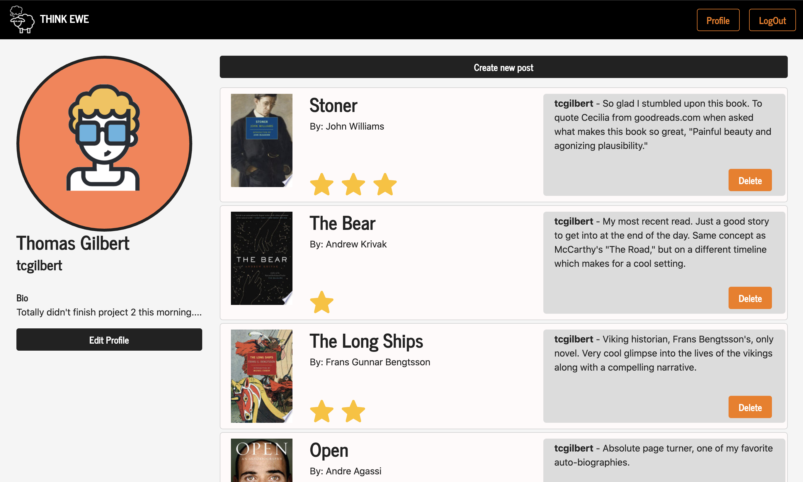

# Think Ewe - social network for readers

Yes... this is goodreads lite. Nevertheless, I choose this project becuase I could offer one thing other book websites don't: a three star rating system. No more ambiguity; 1-star is a good book, 2-stars is a great book, and 3-stars is an exceptional book.  

Anyways... Click here to check it out! <a href="https://think-ewe.herokuapp.com/">Think Ewe</a>

## Original Mockup and Finished Look

--------------------------------------------------------
## Languages, packages, and frameworks
- This is a bare bones node express application (No frontend JS framework)
- Authentication: Passport
- Data Storage and Processing: Postgres, Sequelize
- Templating Engine: EJS
- Styling: Bootstrap, CSS
- Encryption: Bcrypt
- API: google books API, fetching with axios

--------------------------------------------------------

--------------------------------------------------------
## Personal Comments

First thing I would like to note is that though this project meets all the requirements prescribed, it is still a work in progress. Being that I only had a week to build this app there were a lot of features I had envistioned left on the table, and (time-permitting) one day I would like to add the following
- Following and Followers feed
- Likes and comments on posts
- Varying post content: quotes, authors, maybe even blogs
- More styling

---------------------------------------------------------

